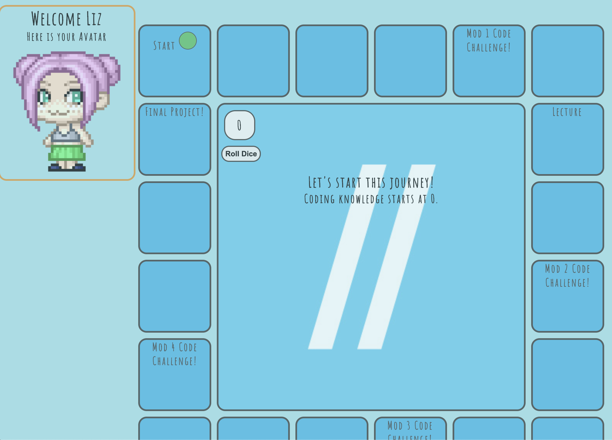
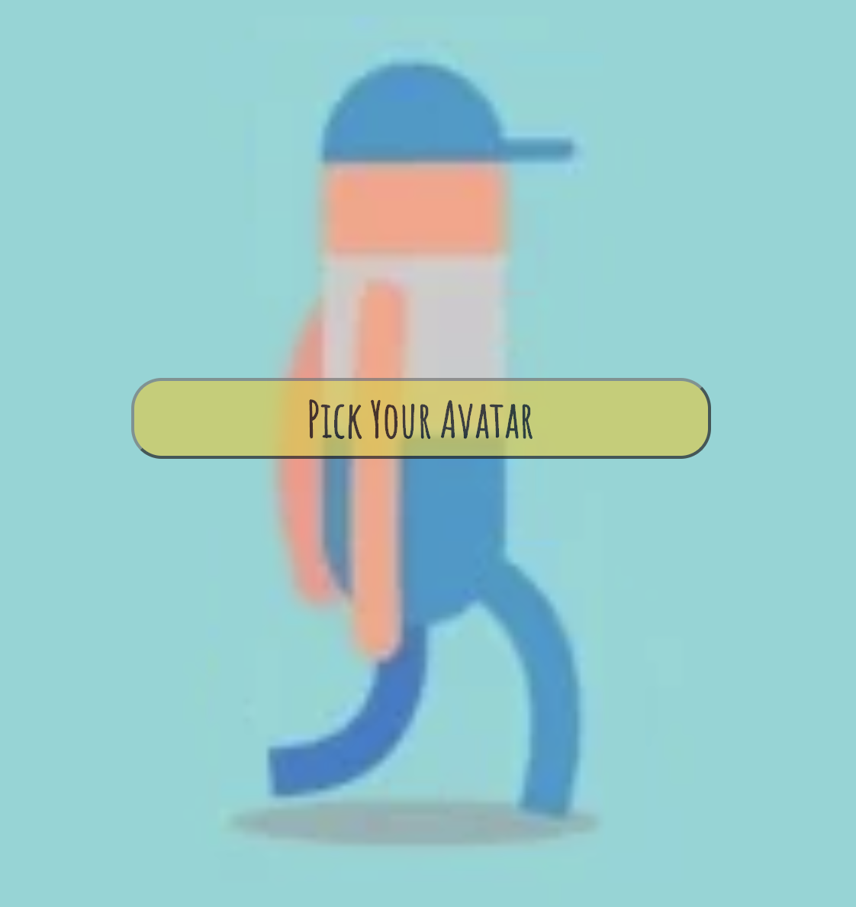
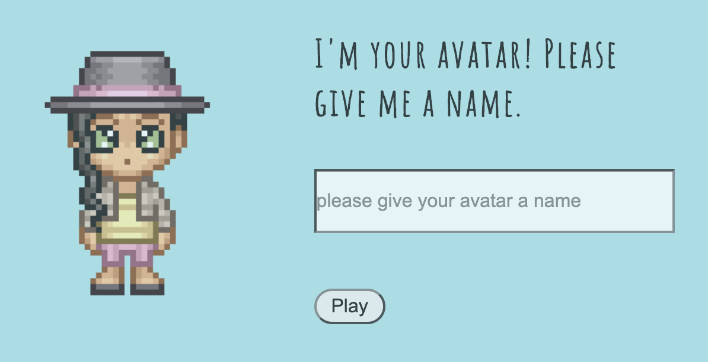
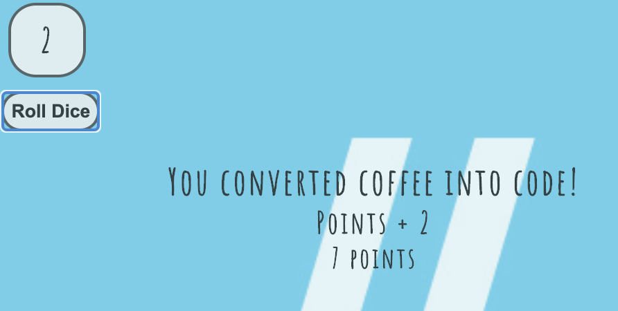

# The Flatiron School Experience (FSE) Board Game

Many people are familiar with the on-campus version of The Flatiron School... but not for us.

As a result of never having been physically at the campus location and still completing this program, we decided to create a parody project to take light of the difficult situation we've all been placed in. Amidst COVID-19, we're still here completing a career change.

The FSE Board Game takes scenarios from experiences we have personally gone through while going through the program.

It utilizes a Ruby on Rails Back-end with a JavaScript front-end.
The CSS used is purely vanilla custom CSS. 

Users pick an avatar

Name their avatar 

Roll a dice and see what happens...

